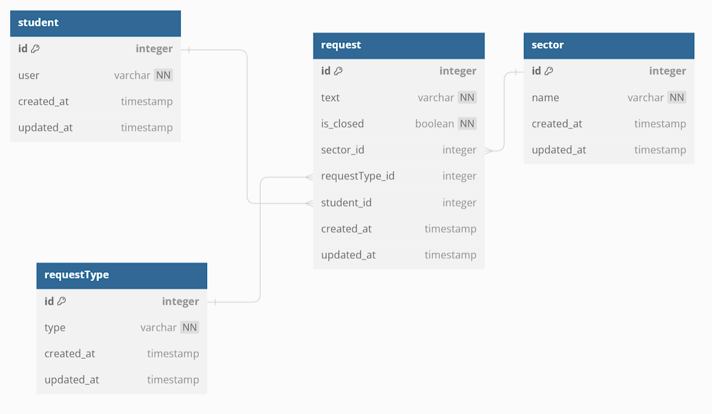

## Database ERD



## Installation

```bash
$ npm install
```

## Running the app

```bash
# first run the project build
$ npm run build

# Then create a database with name selecao
$ CREATE DATABASE selecao

# Then run the migrations to set the database columns and relationships
$ npm run run:migration

# Run the seeds scripts to populate the database
$ npm run seed:run

# Now you can start the project in watch mode
$ npm run start:dev
```
